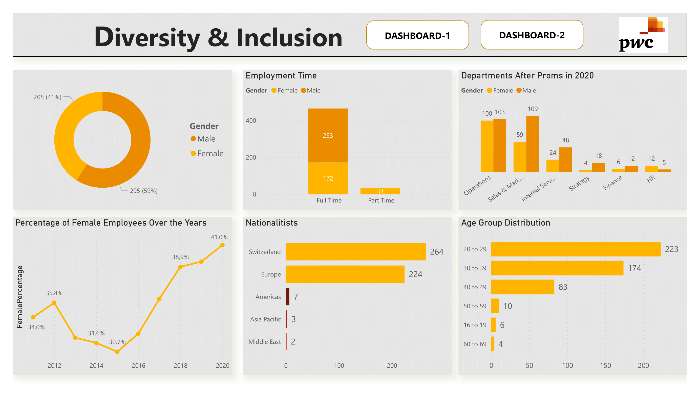
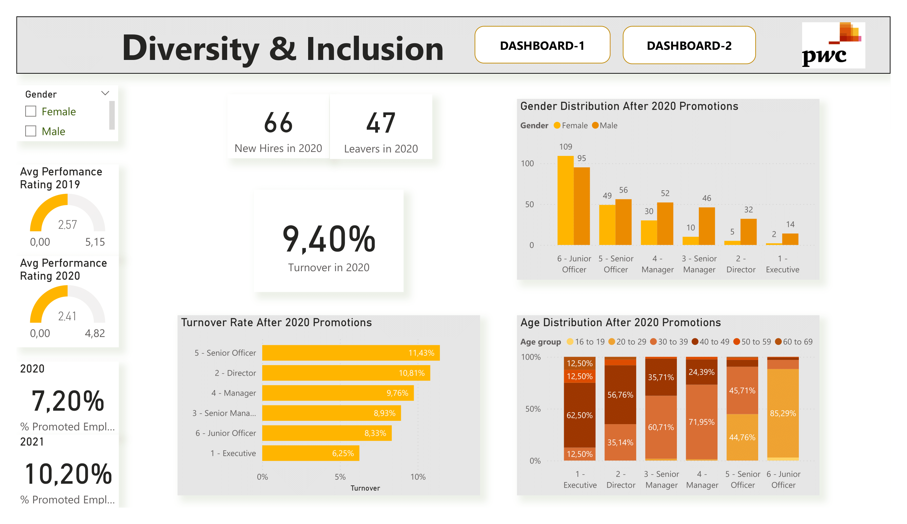

# Diversity & Inclusion Dashboard

This is a part of the Forage Job Simulation and dataset is provided by PWC Switzerland in Excel. 
Dataset includes : 
- Employees' gender, age groups , performance ratings, region groups
- Promotions in 2020 and in 2021.
- Departmens and job levels before and after promotions.
- Last hire dates of employees
- Leavers and new hires in FY21.

I've created the dashboards on Power BI: 

  
